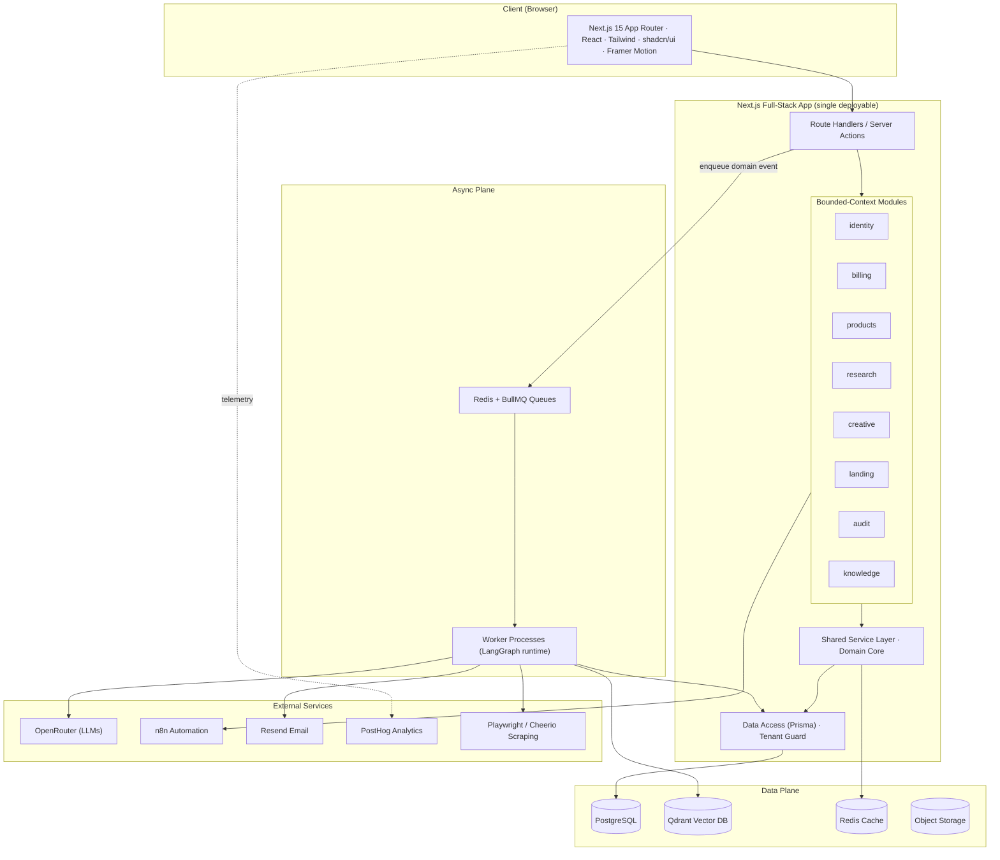

# GrowthOS — System Architecture Overview

> **Status:** Architecture / Planning. **No application code is produced at this stage.**
> This document set is the source of truth for the platform design and must be approved before implementation begins.

GrowthOS is an **AI-powered Ecommerce Operating System** — a multi-tenant SaaS that helps ecommerce brands run their growth function: product analysis, customer research, creative strategy, hooks, marketing angles, UGC concepts, landing-page generation, page audits, and CRO. The long-term vision is the complete AI operating system for ecommerce growth.

---

## 1. Document Index

| # | Document | Covers (from the brief) |
|---|----------|--------------------------|
| 00 | [Overview](./00-overview.md) | System architecture, principles, assumptions |
| 01 | [System Architecture](./01-system-architecture.md) | HLD, LLD, service architecture, event-driven, multi-tenant |
| 02 | [Domain & Data](./02-domain-and-data.md) | Domain model (DDD), bounded contexts, Database ERD |
| 03 | [AI Architecture](./03-ai-architecture.md) | AI architecture, LangGraph workflow diagrams, RAG, cost routing |
| 04 | [API Contracts](./04-api-contracts.md) | Route handlers, server actions, REST contracts, webhooks |
| 05 | [Folder Structure](./05-folder-structure.md) | Modular monolith folder layout |
| 06 | [User Flows](./06-user-flows.md) | End-to-end user journeys |
| 07 | [Security Architecture](./07-security.md) | AuthN/Z, tenant isolation, secrets, AI safety |
| 08 | [Deployment & Ops](./08-deployment-and-ops.md) | Deployment, scalability, cost optimization, observability |
| 09 | [Roadmap](./09-roadmap.md) | MVP roadmap, future roadmap |

---

## 2. Guiding Architecture Principles

1. **Clean Architecture** — dependencies point inward. Domain core knows nothing about Next.js, Prisma, or OpenRouter. Frameworks are plug-ins at the edges.
2. **Domain-Driven Design** — the system is partitioned into **bounded contexts** with explicit ubiquitous language. Each context owns its data and exposes behavior through application services.
3. **Modular Monolith** — one deployable Next.js application, internally split into independent modules with enforced boundaries. This gives us microservice-like separation without distributed-systems overhead. Modules can be extracted into services later if a single context outgrows the monolith.
4. **Event-Driven** — long-running and side-effectful work (AI generation, scraping, emails, analytics) is dispatched as **domain events** onto a queue (BullMQ/Redis) and processed by workers. The HTTP request path stays fast.
5. **Multi-Tenant Ready** — every row is scoped to an `organizationId`. Isolation is enforced at the data-access layer, not left to individual queries.
6. **AI-First** — AI is a first-class architectural layer (LangGraph agents, RAG over Qdrant, model routing via OpenRouter), not a bolted-on API call. Determinism, observability, cost control, and safety are designed in.

---

## 3. The Modular Monolith at a Glance

---

## 4. Bounded Contexts (Modules)

| Context | Responsibility | Owns |
|---------|----------------|------|
| **identity** | Orgs, users, roles, sessions, invitations | `Organization`, `User`, `Membership`, `Invite` |
| **billing** | Plans, subscriptions, usage metering, AI credit ledger | `Plan`, `Subscription`, `UsageRecord`, `CreditLedger` |
| **products** | Product ingestion (manual + scraped), normalization | `Product`, `ProductSource`, `ProductSnapshot` |
| **research** | Customer/market research generation | `ResearchReport`, `Persona`, `PainPoint`, `Competitor` |
| **creative** | Hooks, angles, UGC concepts, creative strategies | `CreativeBrief`, `Hook`, `Angle`, `UGCConcept` |
| **landing** | Landing-page generation & versioning | `LandingPage`, `PageBlock`, `PageVersion` |
| **audit** | Page audits, CRO scoring & recommendations | `AuditRun`, `Finding`, `Recommendation`, `Score` |
| **knowledge** | RAG corpus, embeddings, retrieval (shared capability) | `Document`, `Chunk`, `Embedding` (Qdrant payload) |
| **platform** (cross-cutting) | Jobs, events, audit log, notifications, feature flags | `Job`, `DomainEvent`, `ActivityLog`, `Notification` |

Detailed aggregates and invariants are in [02-domain-and-data.md](./02-domain-and-data.md).

---

## 5. Request Lifecycle (two paths)

**Synchronous (read / light write):**
`Client → Server Action/Route Handler → Application Service → Tenant-scoped Repository → PostgreSQL → response`

**Asynchronous (AI / scrape / email):**
`Client → Route Handler validates + creates Job (status=queued) → emits DomainEvent → BullMQ → Worker runs LangGraph agent → writes result + updates Job → client notified via polling/SSE → PostHog event`

This split is the backbone of the whole system: **the user-facing app never blocks on an LLM call.**

---

## 6. Stated Assumptions (to be confirmed)

These are reasonable defaults chosen so design can proceed; flag any you want changed.

1. **Audience:** self-serve SaaS for ecommerce operators/agencies (not a single internal team). Multi-tenant from day one.
2. **Scale target for v1:** low thousands of organizations, tens of thousands of AI jobs/day. A single VPS (vertically scaled) + separate worker process is sufficient; design must allow horizontal worker scaling without re-architecture.
3. **Tenancy model:** ✅ **CONFIRMED** — shared database, shared schema, row-level `organizationId` scoping (**pool model**) with Postgres RLS. Cheapest/simplest on a VPS; revisit schema-per-tenant only for enterprise contracts.
4. **Billing:** subscription tiers + metered AI usage via a **credit system** (1 generation = N credits). ✅ **CONFIRMED payment provider: Stripe** (Checkout + Billing + webhooks), integrated behind a `PaymentGateway` port so the billing domain stays provider-agnostic. Note: Stripe is not a merchant-of-record, so EU VAT/sales-tax handling must be added (Stripe Tax) before EU launch.
5. **AI provider:** OpenRouter as the single gateway; we route per-task to cheap vs. frontier models. No direct provider SDKs.
6. **Hosting:** Docker images orchestrated by Coolify on a VPS; Postgres, Redis, Qdrant run as managed containers with backups.
7. **Compliance:** GDPR-aware (EU users likely). PII minimization, data export/delete, region-pinned hosting.

---

## 7. Key Cross-Cutting Decisions (ADR summary)

| Decision | Choice | Rationale |
|----------|--------|-----------|
| App topology | Modular monolith on Next.js full-stack | Solo/small team velocity; one deploy; clean module boundaries preserve future extraction |
| Async work | BullMQ on Redis + dedicated worker process | LLM/scrape latency must not block requests; retries, rate-limit, backoff for free |
| AI orchestration | LangGraph stateful graphs in workers | Multi-step agentic flows need durable state, branching, human-in-loop |
| Model access | OpenRouter with internal model-router | Cost/quality routing, provider failover, one billing surface |
| Retrieval | Qdrant + per-tenant collections/payload filter | Tenant-isolated RAG, hybrid search |
| Tenant isolation | Repository-level org guard + Postgres RLS (defense in depth) | Prevent cross-tenant leakage even on a buggy query |
| Data access | Prisma behind repository interfaces | Domain stays persistence-agnostic; testable |
| Payments | Stripe behind a `PaymentGateway` port | Confirmed; domain stays provider-agnostic, swappable later |

Full reasoning lives in the relevant per-area documents.
