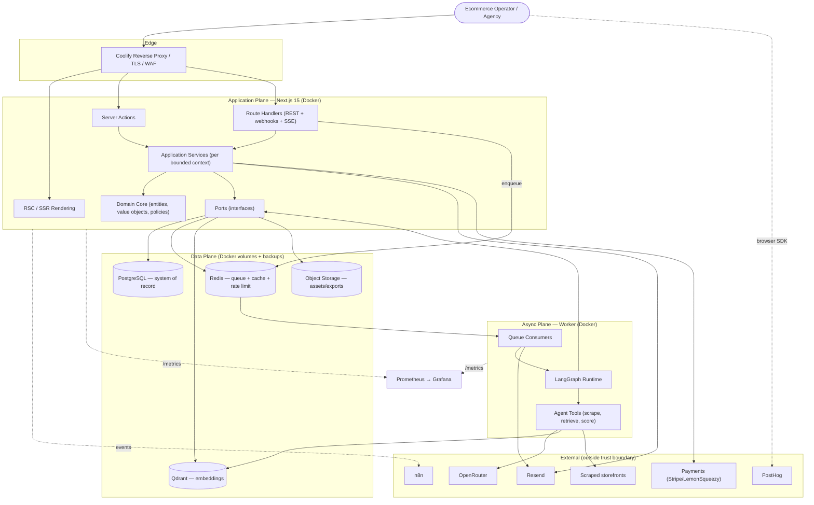
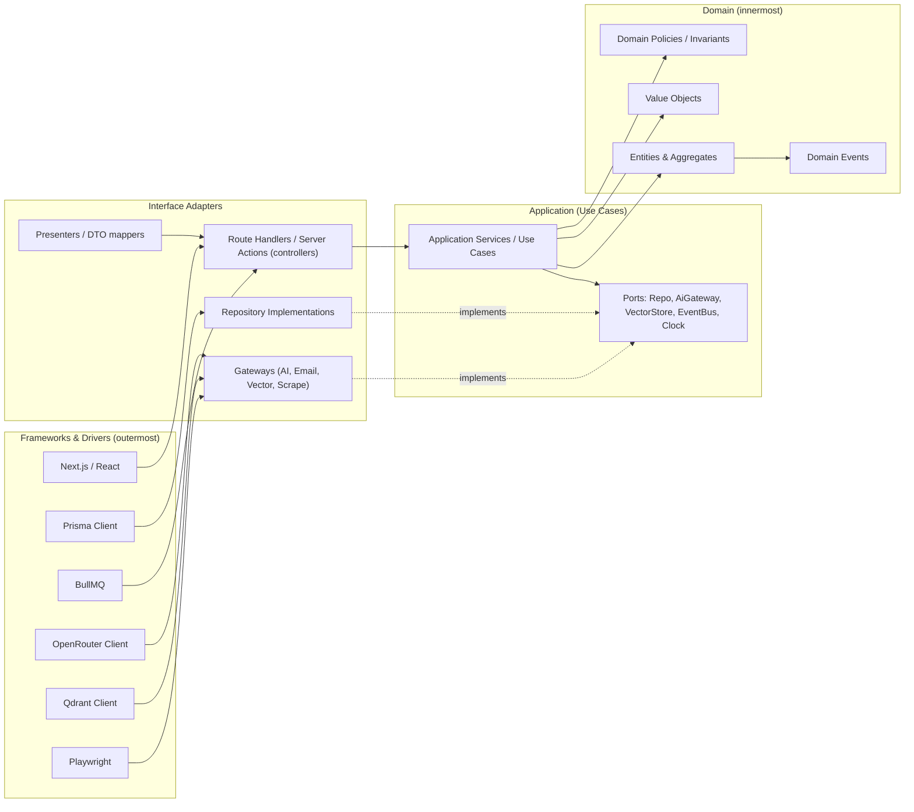
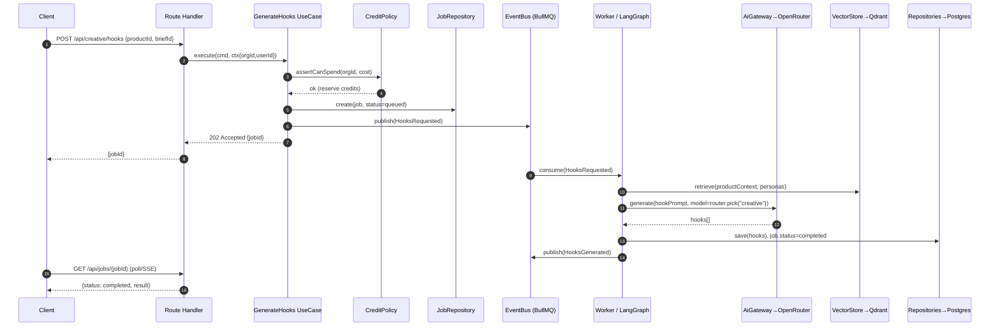
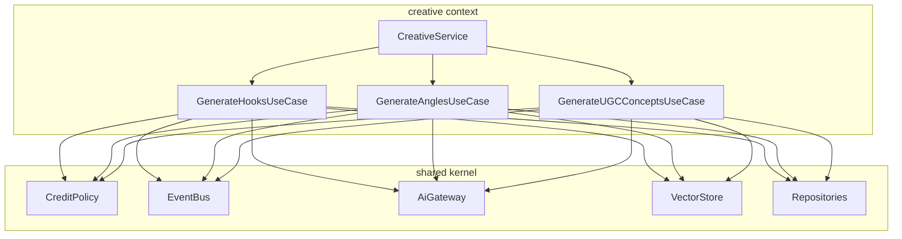
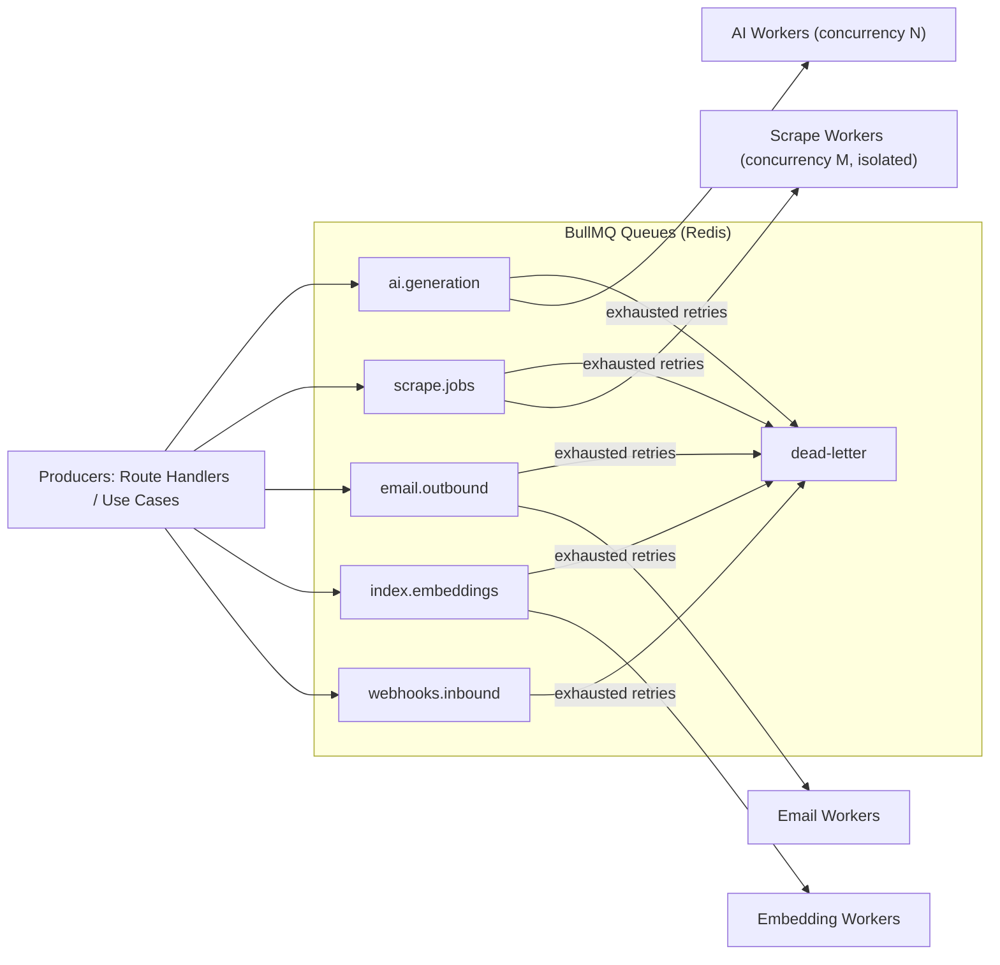
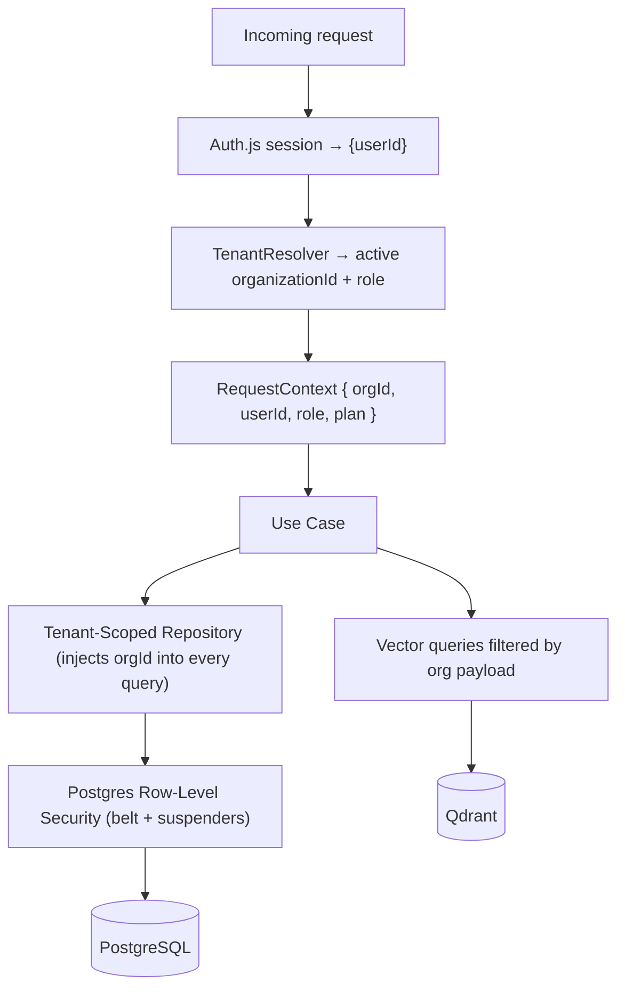

# 01 — System Architecture (HLD + LLD)

Covers: complete system architecture, high-level diagram, low-level diagram, service architecture, event-driven design, multi-tenant architecture.

---

## 1. High-Level Architecture

Three planes: **Edge/App plane** (synchronous, user-facing), **Async plane** (workers + queues), **Data plane** (stateful stores). External SaaS sits outside the trust boundary.

**Why two processes (web + worker) from one codebase:** they share the domain/Prisma layer but scale and fail independently. A runaway LLM job or a Playwright memory spike cannot take down the web tier.

---

## 2. Low-Level Architecture (Clean Architecture layers)

Dependencies point **inward only**. The domain core has zero imports from Next.js, Prisma, BullMQ, or OpenRouter.

**Dependency rule enforcement:** ports are TypeScript interfaces declared in the application layer; concrete adapters live in infrastructure and are wired by a composition root (DI container) at process start. Module-boundary linting (e.g. `eslint-plugin-boundaries` / `dependency-cruiser`) fails CI if domain imports infrastructure.

### 2.1 Anatomy of one use case (example: "Generate Hooks")

---

## 3. Service (Application) Architecture

Each bounded context exposes a thin set of **application services** that orchestrate domain logic and ports. Controllers never touch repositories or Prisma directly.

**Service rules:**
- One use case = one transaction boundary (where DB writes occur synchronously).
- Use cases are **pure orchestration**; business invariants live in the aggregate.
- Cross-context calls go through the other context's **public application service** or via an event — never by reaching into its repository or tables.
- All AI/scrape side effects are deferred to workers via events; use cases only *reserve* resources and enqueue.

---

## 4. Event-Driven Design

### 4.1 Event taxonomy

| Type | Example | Transport | Consumer |
|------|---------|-----------|----------|
| **Command event** (work to do) | `HooksRequested`, `PageAuditRequested`, `ProductScrapeRequested` | BullMQ queue | Worker |
| **Domain event** (fact that happened) | `HooksGenerated`, `SubscriptionActivated`, `CreditsExhausted` | BullMQ topic + outbox | Workers, notifications, n8n, PostHog |
| **Integration event** (external) | Payment webhook, n8n trigger | Route Handler → internal event | Application services |

### 4.2 Queues

**Reliability patterns:**
- **Transactional outbox:** domain events are written to an `outbox` table in the same Postgres transaction as the state change; a relay publishes them to BullMQ. Guarantees no lost events on crash.
- **Idempotency:** every job carries an idempotency key (`orgId + useCase + inputHash`); consumers no-op on duplicates.
- **Retries with backoff + DLQ:** transient failures retry (exponential); poisoned jobs land in dead-letter for inspection.
- **Per-tenant fairness:** queue rate-limiting keyed by `orgId` prevents one heavy tenant starving others.

---

## 5. Multi-Tenant Architecture

**Model:** shared DB / shared schema / **row-level tenancy** keyed by `organizationId` (pool model). Chosen for cost and operational simplicity on a VPS; the data-access layer makes isolation automatic and the model can graduate to schema-per-tenant for enterprise without domain changes.

**Three isolation layers (defense in depth):**
1. **Application:** `RequestContext.orgId` is mandatory; repositories refuse to build a query without it.
2. **Database:** Postgres **Row-Level Security** policies on every tenant table using a `current_setting('app.org_id')` GUC set per connection/transaction. Even a forgotten `WHERE` cannot leak rows.
3. **Vector store:** each `organizationId` is a **payload filter** (and optionally a dedicated Qdrant collection for large tenants); retrieval always filters by org.

**Tenant-aware concerns:** rate limits, credit ledgers, feature flags, and usage metrics are all keyed by `organizationId`. Background jobs carry `orgId` in their payload and re-establish the RLS GUC before any query.

**Noisy-neighbor controls:** per-org queue concurrency caps, per-org token-bucket rate limits in Redis, and plan-based credit ceilings.

---

## 6. Caching Strategy

| Layer | Cache | TTL / Invalidation |
|-------|-------|--------------------|
| RSC / fetch | Next.js Data Cache + tags | Tag-based revalidation on mutation |
| Hot reads (org settings, plan, flags) | Redis | Write-through on update |
| Expensive AI outputs | Postgres (persisted) + content-hash dedupe | Reuse identical (prompt+model+input) results |
| Vector retrieval | Redis (short TTL) keyed by query hash | 5–15 min |
| Rate-limit / idempotency | Redis | Sliding window |

Identical AI requests (same normalized input + model + prompt version) return a **cached generation** rather than re-billing tokens — a direct cost lever (see [08](./08-deployment-and-ops.md)).
