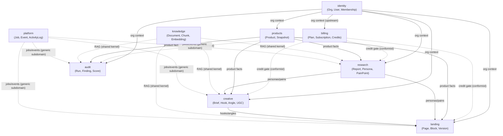
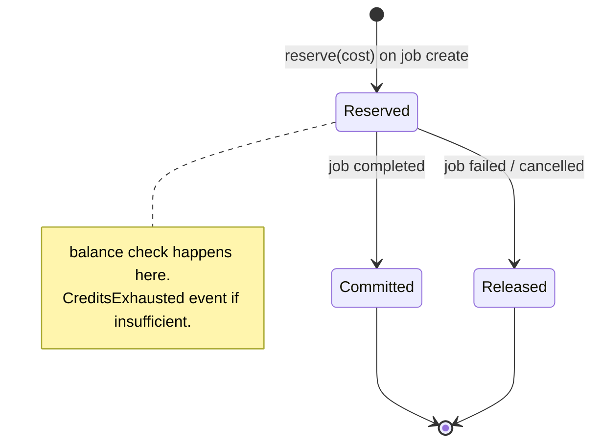

# 02 — Domain Model & Data Architecture

Covers: DDD domain model, bounded contexts & aggregates, Database ERD.

---

## 1. Bounded Context Map

**Relationship types (DDD):**
- `identity` is **upstream** of everything (supplies org/user context).
- `billing` is a **conformist gate** — other contexts ask "can this org spend N credits?" and respect the answer.
- `knowledge` is a **shared kernel** capability (RAG) consumed by generative contexts.
- `platform` is a **generic subdomain** (jobs, events, audit log, notifications).
- Generative contexts depend **downstream** on `products` and `research` for grounding facts.

---

## 2. Aggregates, Invariants & Ubiquitous Language

### identity
- **Organization** (aggregate root): tenant boundary. Invariant: must have ≥1 `OWNER` membership.
- **User**: global identity; may belong to many orgs.
- **Membership**: (user, org, role∈{OWNER, ADMIN, EDITOR, VIEWER}). Invariant: a user has exactly one membership per org.
- **Invite**: pending membership; expires; single-use token.

### billing
- **Subscription** (root): org's current plan + status. Invariant: at most one active subscription per org.
- **CreditLedger** (root): append-only entries (`+grant`, `-spend`, `+refund`). Invariant: running balance ≥ 0; a reservation must be committed or released. Ubiquitous terms: *grant, reserve, commit, refund, balance*.
- **UsageRecord**: metered events for analytics/billing reconciliation.

### products
- **Product** (root): canonical product the org is marketing. Holds title, description, price, attributes, media refs.
- **ProductSource**: where it came from (manual, URL, Shopify). 
- **ProductSnapshot**: immutable capture of a scraped page (raw + normalized). Invariant: snapshots are never mutated; new scrape = new snapshot.

### research
- **ResearchReport** (root): a generated research artifact for a product. Contains **Persona**, **PainPoint**, **Desire**, **Objection**, **Competitor** value objects/entities. Invariant: a report is immutable once `status=completed`; regeneration creates a new version.

### creative
- **CreativeBrief** (root): inputs/constraints (audience, tone, platform, offer).
- **Hook**, **Angle**, **UGCConcept** (entities under brief or product): generated assets with `status`, `score`, `rationale`, `modelMeta`. Invariant: every generated asset records the `promptVersion`, `model`, and `jobId` that produced it (provenance).

### landing
- **LandingPage** (root): structured page (ordered **PageBlock** list) + **PageVersion** history. Invariant: exactly one `published` version at a time; edits create drafts.

### audit
- **AuditRun** (root): an audit of a target URL or internal page. Contains **Finding** (issue), **Recommendation**, and a composite **Score** (value object: conversion, clarity, trust, speed). Invariant: findings reference a snapshot; score is recomputed, never hand-edited.

### knowledge (shared kernel)
- **Document** → **Chunk** → **Embedding**. Embeddings live in Qdrant; Postgres stores chunk text + metadata + Qdrant point id. Invariant: every chunk is tagged with `organizationId` and `sourceRef`.

### platform (generic)
- **Job** (root): lifecycle `queued→running→completed|failed|cancelled`, with `useCase`, `input`, `result`, `error`, `costCredits`, `idempotencyKey`.
- **DomainEvent** / **Outbox**: durable event record.
- **ActivityLog**: immutable audit trail of user/org actions.
- **Notification**: in-app + email fan-out record.

---

## 3. Database ERD (PostgreSQL)

> Every tenant-scoped table carries `organization_id` and is governed by Row-Level Security. `id` columns are UUID/ULID. Timestamps (`created_at`, `updated_at`) and soft-delete (`deleted_at`) are implied on entities.

```mermaid
erDiagram
    ORGANIZATION ||--o{ MEMBERSHIP : has
    USER ||--o{ MEMBERSHIP : has
    ORGANIZATION ||--o{ INVITE : issues
    ORGANIZATION ||--|| SUBSCRIPTION : owns
    PLAN ||--o{ SUBSCRIPTION : defines
    ORGANIZATION ||--o{ CREDIT_LEDGER : accrues
    ORGANIZATION ||--o{ USAGE_RECORD : meters

    ORGANIZATION ||--o{ PRODUCT : owns
    PRODUCT ||--o{ PRODUCT_SOURCE : from
    PRODUCT ||--o{ PRODUCT_SNAPSHOT : captures

    ORGANIZATION ||--o{ RESEARCH_REPORT : owns
    PRODUCT ||--o{ RESEARCH_REPORT : about
    RESEARCH_REPORT ||--o{ PERSONA : contains
    RESEARCH_REPORT ||--o{ PAIN_POINT : contains
    RESEARCH_REPORT ||--o{ COMPETITOR : contains

    ORGANIZATION ||--o{ CREATIVE_BRIEF : owns
    PRODUCT ||--o{ CREATIVE_BRIEF : targets
    CREATIVE_BRIEF ||--o{ HOOK : yields
    CREATIVE_BRIEF ||--o{ ANGLE : yields
    CREATIVE_BRIEF ||--o{ UGC_CONCEPT : yields

    ORGANIZATION ||--o{ LANDING_PAGE : owns
    PRODUCT ||--o{ LANDING_PAGE : for
    LANDING_PAGE ||--o{ PAGE_VERSION : versions
    PAGE_VERSION ||--o{ PAGE_BLOCK : composed_of

    ORGANIZATION ||--o{ AUDIT_RUN : owns
    AUDIT_RUN ||--o{ FINDING : surfaces
    FINDING ||--o| RECOMMENDATION : resolved_by
    PRODUCT_SNAPSHOT ||--o{ AUDIT_RUN : audited_by

    ORGANIZATION ||--o{ DOCUMENT : owns
    DOCUMENT ||--o{ CHUNK : split_into

    ORGANIZATION ||--o{ JOB : runs
    ORGANIZATION ||--o{ ACTIVITY_LOG : records
    ORGANIZATION ||--o{ OUTBOX_EVENT : emits
    JOB ||--o| HOOK : produced
    JOB ||--o| RESEARCH_REPORT : produced
    JOB ||--o| AUDIT_RUN : produced

    ORGANIZATION {
        uuid id PK
        string name
        string slug UK
        jsonb settings
    }
    USER {
        uuid id PK
        string email UK
        string name
        string image
    }
    MEMBERSHIP {
        uuid id PK
        uuid organization_id FK
        uuid user_id FK
        enum role
    }
    SUBSCRIPTION {
        uuid id PK
        uuid organization_id FK
        uuid plan_id FK
        enum status
        timestamp current_period_end
        string provider_ref
    }
    PLAN {
        uuid id PK
        string code UK
        int monthly_credits
        jsonb feature_flags
        int price_cents
    }
    CREDIT_LEDGER {
        uuid id PK
        uuid organization_id FK
        enum entry_type
        int amount
        int balance_after
        uuid job_id FK
        string reason
    }
    PRODUCT {
        uuid id PK
        uuid organization_id FK
        string title
        text description
        int price_cents
        jsonb attributes
    }
    PRODUCT_SNAPSHOT {
        uuid id PK
        uuid organization_id FK
        uuid product_id FK
        string source_url
        text raw_html
        jsonb normalized
        string content_hash
    }
    RESEARCH_REPORT {
        uuid id PK
        uuid organization_id FK
        uuid product_id FK
        int version
        enum status
        jsonb summary
        uuid job_id FK
    }
    CREATIVE_BRIEF {
        uuid id PK
        uuid organization_id FK
        uuid product_id FK
        jsonb constraints
    }
    HOOK {
        uuid id PK
        uuid organization_id FK
        uuid brief_id FK
        text content
        float score
        string angle_type
        jsonb model_meta
        uuid job_id FK
    }
    LANDING_PAGE {
        uuid id PK
        uuid organization_id FK
        uuid product_id FK
        uuid published_version_id FK
    }
    PAGE_VERSION {
        uuid id PK
        uuid organization_id FK
        uuid landing_page_id FK
        int version
        enum status
    }
    PAGE_BLOCK {
        uuid id PK
        uuid page_version_id FK
        int position
        enum block_type
        jsonb content
    }
    AUDIT_RUN {
        uuid id PK
        uuid organization_id FK
        string target_url
        uuid snapshot_id FK
        jsonb score
        enum status
        uuid job_id FK
    }
    FINDING {
        uuid id PK
        uuid audit_run_id FK
        enum severity
        enum category
        text description
    }
    DOCUMENT {
        uuid id PK
        uuid organization_id FK
        enum source_type
        string source_ref
    }
    CHUNK {
        uuid id PK
        uuid organization_id FK
        uuid document_id FK
        text content
        string qdrant_point_id
        jsonb metadata
    }
    JOB {
        uuid id PK
        uuid organization_id FK
        string use_case
        enum status
        jsonb input
        jsonb result
        int cost_credits
        string idempotency_key UK
        text error
    }
    OUTBOX_EVENT {
        uuid id PK
        uuid organization_id FK
        string event_type
        jsonb payload
        enum status
        timestamp published_at
    }
    ACTIVITY_LOG {
        uuid id PK
        uuid organization_id FK
        uuid actor_user_id FK
        string action
        jsonb context
    }
```

---

## 4. Data Architecture Decisions

| Concern | Decision |
|---------|----------|
| **IDs** | ULID (sortable, index-friendly) stored as UUID type |
| **Tenancy column** | `organization_id` on every tenant table + composite indexes `(organization_id, …)` |
| **RLS** | Postgres policy per tenant table using `app.org_id` session GUC |
| **Immutability** | Snapshots, completed reports, ledger entries, activity logs are append-only |
| **Versioning** | Research reports and landing pages version instead of mutate (auditability + rollback) |
| **JSONB** | Used for flexible AI output payloads, model metadata, settings — validated by Zod before persist |
| **Provenance** | Every AI-generated row links to its `job_id`, `model`, `promptVersion` |
| **Soft delete** | `deleted_at` for user-visible entities; hard delete on GDPR erasure |
| **Vector data** | Lives in Qdrant; Postgres keeps the chunk text + point id mapping (source of truth for re-indexing) |
| **Migrations** | Prisma Migrate, forward-only, reviewed; RLS policies applied via SQL migration alongside |

### 4.1 Credit reservation flow (ledger invariant)

The ledger is the **single source of truth** for spend; `Job.cost_credits` is denormalized for convenience but reconciled against ledger entries.
