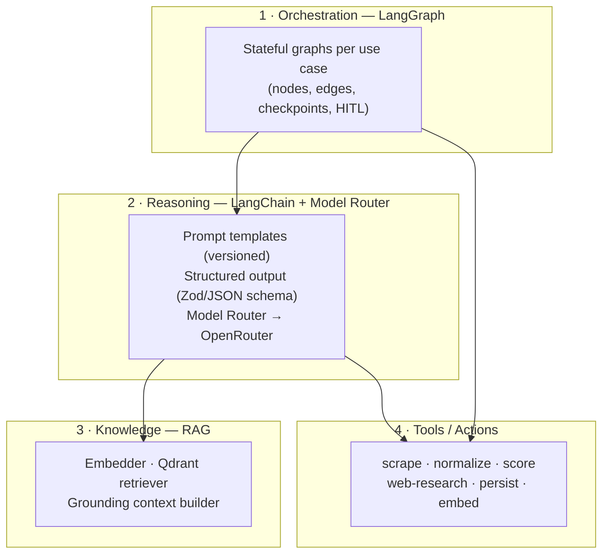
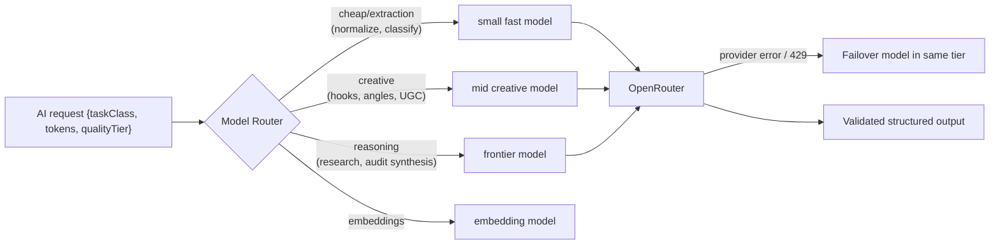
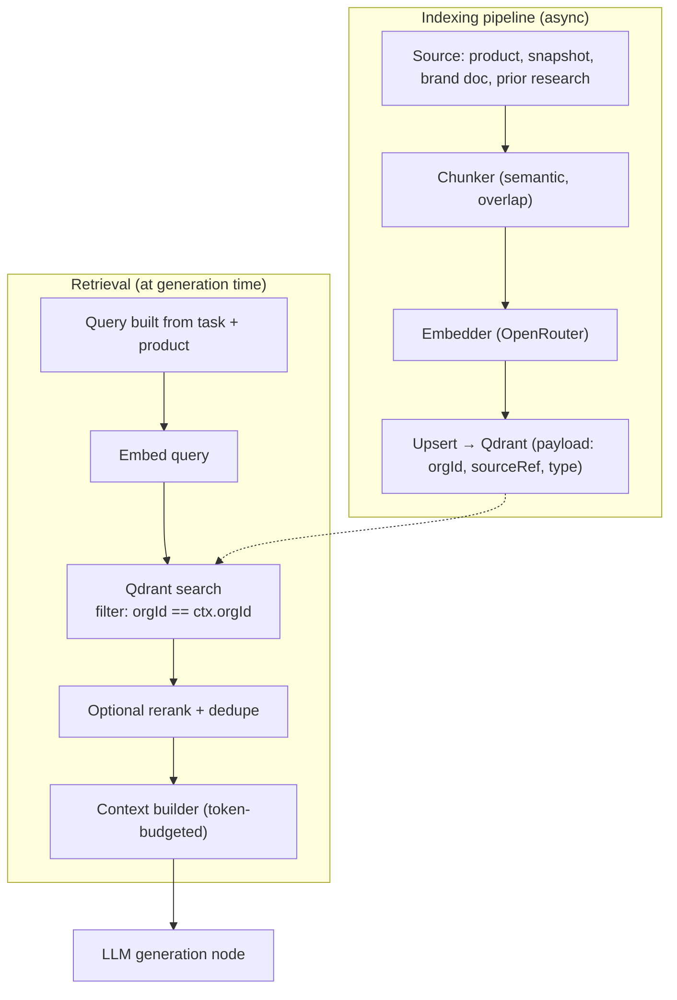
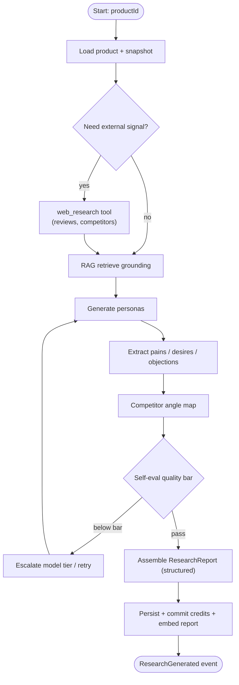
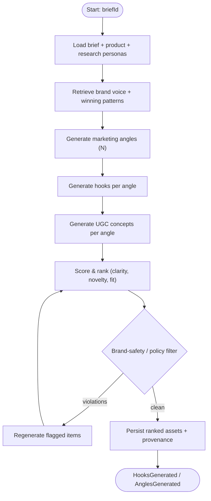
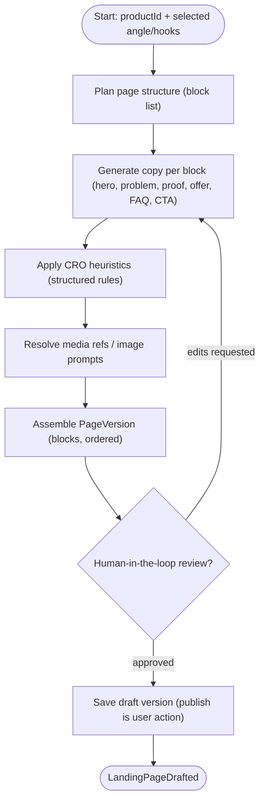
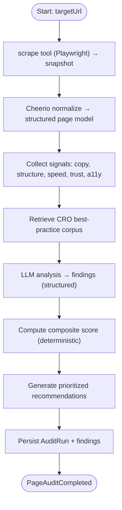
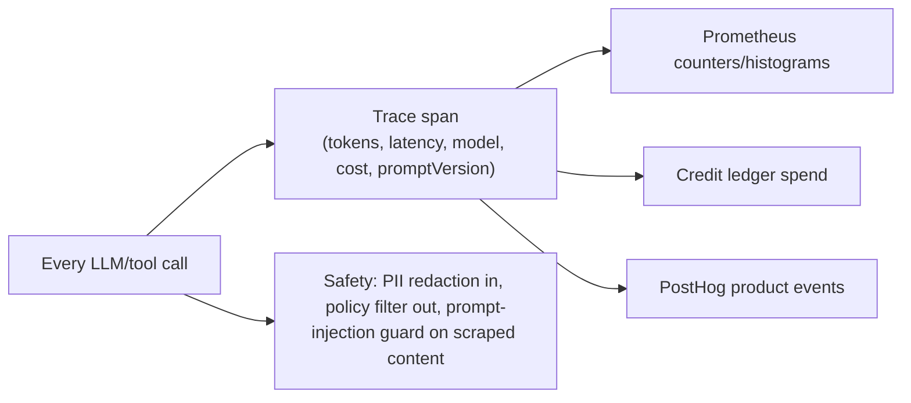

# 03 — AI Architecture & LangGraph Workflows

Covers: AI architecture, LangGraph workflow diagrams, RAG design, model routing, cost & safety controls.

---

## 1. AI Layering

AI is a dedicated architectural layer with four sub-layers, all running inside **workers** (never the request path):

**Principles:**
- **Structured-output everywhere.** Every LLM call returns schema-validated JSON (Zod). No free-text parsing into the domain.
- **Versioned prompts.** Prompts are content-addressed assets (`promptVersion`) stored in the repo; every generation records which version produced it.
- **Determinism knobs.** Temperature, model, and seed (where supported) are part of the recorded `model_meta` for reproducibility and A/B testing.
- **Grounding-first.** Generative tasks retrieve product facts + research + brand voice from Qdrant before generating, reducing hallucination.

---

## 2. Model Router (OpenRouter)

A single internal `AiGateway` port; the **Model Router** picks a model per task class to balance cost vs. quality, with failover.

**Router inputs:** task class, required quality tier (from plan), input size, and current cost budget. **Policies:** prefer cheapest model that passes a quality bar for the task; escalate tier on validation failure or low self-eval score; hard fail-over to an alternate provider on 5xx/429.

---

## 3. RAG Architecture

**Tenant isolation in RAG:** every Qdrant point carries `organizationId` in its payload; every search **must** include the org filter (enforced by the `VectorStore` adapter, not the caller). Large/enterprise tenants can be promoted to a dedicated collection. Re-indexing is always possible from Postgres (chunks are the source of truth).

---

## 4. LangGraph Workflows

Each AI feature is a LangGraph graph with durable checkpoints (so a crash resumes mid-flow) and explicit error/escalation edges.

### 4.1 Customer Research

### 4.2 Creative Generation (Hooks / Angles / UGC)

### 4.3 Landing Page Generation

### 4.4 Page Audit / CRO

### 4.5 Graph control features (all graphs)
- **Checkpointing:** state persisted per node → resume after worker crash.
- **Timeouts & budgets:** per-node token/time budget; exceeding budget routes to a graceful-degrade node.
- **Human-in-the-loop:** interrupt nodes pause the graph and await a user decision (landing-page review, audit approval).
- **Idempotency:** graph keyed by `jobId`; re-running a completed job is a no-op.

---

## 5. AI Observability, Cost & Safety

| Concern | Control |
|---------|---------|
| **Cost** | Model routing, output caching by content hash, token budgets, cheap-model pre-pass for extraction, batch embeddings |
| **Quality** | Structured-output validation, self-eval node, tiered escalation, eval suite on prompt changes |
| **Safety** | Input PII redaction, output brand/policy filter, **scraped content treated as untrusted** (prompt-injection isolation), allow-list of tool actions |
| **Reproducibility** | Recorded `model_meta` (model, temp, seed, promptVersion) per generation |
| **Observability** | Per-call tracing → Prometheus/Grafana; spend → ledger; product analytics → PostHog |
| **Failure** | Per-node retries, model failover, DLQ, graceful-degrade nodes that return partial results with a flag |

**Prompt-injection stance:** any text fetched from external storefronts/reviews enters the prompt inside a clearly delimited, untrusted block, and tools the model can invoke are an explicit allow-list — scraped text can never cause credential access, arbitrary fetches, or cross-tenant reads.
