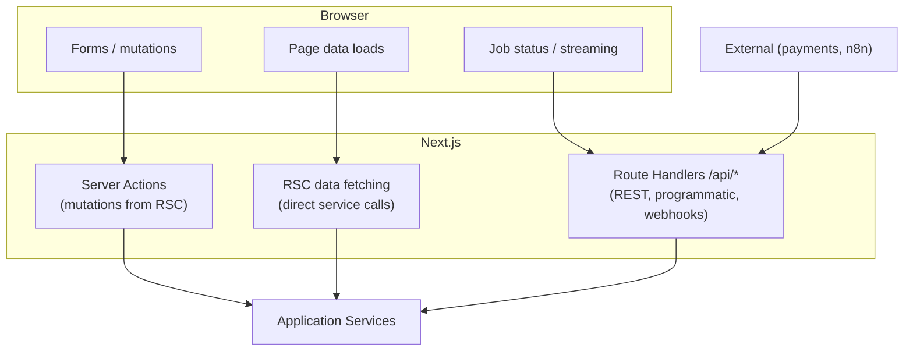
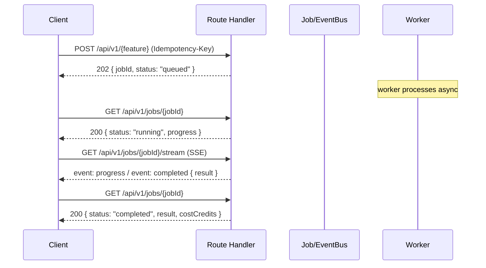

# 04 — API Contracts

Covers: route handlers, server actions, REST contracts, async job protocol, webhooks, SSE. **Contracts only — no implementation.**

---

## 1. API Surface Map



**When to use which:**
- **Server Actions** — primary path for first-party UI mutations (create product, request generation, edit page). Progressive enhancement, typed, CSRF-safe.
- **Route Handlers (`/api/*`)** — async job polling/streaming, inbound webhooks, public/programmatic API (future), file uploads/exports.
- **RSC direct calls** — read models render server-side by calling application services directly (no HTTP hop).

---

## 2. Conventions

| Aspect | Convention |
|--------|-----------|
| Auth | Auth.js session (cookie) for first-party; bearer API key for programmatic (future) |
| Tenant | `organizationId` derived from session/active org — **never** taken from request body |
| Validation | Zod schema at the boundary; reject with `422` + field errors |
| Versioning | `/api/v1/...` prefix on REST handlers |
| Errors | Problem+JSON: `{ error: { code, message, details?, traceId } }` |
| Idempotency | `Idempotency-Key` header on generation POSTs |
| Pagination | Cursor-based: `?cursor=&limit=` → `{ items, nextCursor }` |
| Rate limits | Per-org token bucket; `429` + `Retry-After` |
| Long work | **202 Accepted + jobId**, never block the request |

---

## 3. Async Job Protocol (core pattern)

All AI/scrape features follow the same contract:



**`Job` resource (response shape):**
```
{
  jobId, useCase, status,            // queued|running|completed|failed|cancelled
  progress?: { node, pct },
  result?: <use-case payload>,
  error?: { code, message },
  costCredits, createdAt, completedAt
}
```

---

## 4. Endpoint Catalog (contracts)

> Notation: method · path · request → response. All tenant-scoped; all return Problem+JSON on error.

### identity & org
- `POST /api/v1/orgs` · `{ name }` → `201 { org }`
- `POST /api/v1/orgs/{id}/invites` · `{ email, role }` → `201 { invite }`
- `POST /api/v1/invites/{token}/accept` → `200 { membership }`
- `GET  /api/v1/me` → `200 { user, memberships, activeOrg }`

### billing
- `GET  /api/v1/billing/subscription` → `200 { plan, status, periodEnd }`
- `GET  /api/v1/billing/credits` → `200 { balance, recentEntries }`
- `POST /api/v1/billing/checkout` · `{ planCode }` → `200 { checkoutUrl }`
- `POST /api/v1/webhooks/payments` *(provider → us)* → `200` (signature-verified)

### products
- `POST /api/v1/products` · `{ title, description?, priceCents?, attributes? }` → `201 { product }`
- `POST /api/v1/products/import` · `{ url }` → `202 { jobId }` *(scrape+normalize)*
- `GET  /api/v1/products?cursor=&limit=` → `200 { items, nextCursor }`
- `GET  /api/v1/products/{id}` → `200 { product, snapshots }`

### research
- `POST /api/v1/research` · `{ productId, options? }` → `202 { jobId }`
- `GET  /api/v1/research/{id}` → `200 { report }`
- `GET  /api/v1/products/{id}/research` → `200 { items }`

### creative
- `POST /api/v1/creative/briefs` · `{ productId, constraints }` → `201 { brief }`
- `POST /api/v1/creative/hooks` · `{ briefId, count? }` → `202 { jobId }`
- `POST /api/v1/creative/angles` · `{ briefId }` → `202 { jobId }`
- `POST /api/v1/creative/ugc` · `{ briefId }` → `202 { jobId }`
- `GET  /api/v1/creative/briefs/{id}/assets` → `200 { hooks, angles, ugc }`

### landing
- `POST /api/v1/landing` · `{ productId, angleId?, hookIds? }` → `202 { jobId }`
- `GET  /api/v1/landing/{id}` → `200 { page, versions }`
- `PUT  /api/v1/landing/{id}/blocks` · `{ versionId, blocks }` → `200 { version }` *(draft edit)*
- `POST /api/v1/landing/{id}/publish` · `{ versionId }` → `200 { page }`
- `POST /api/v1/landing/{id}/export` · `{ format }` → `202 { jobId }`

### audit
- `POST /api/v1/audits` · `{ targetUrl }` *or* `{ landingPageId }` → `202 { jobId }`
- `GET  /api/v1/audits/{id}` → `200 { run, findings, recommendations, score }`

### platform
- `GET  /api/v1/jobs/{id}` → `200 { job }`
- `GET  /api/v1/jobs/{id}/stream` *(SSE)* → progress/completed events
- `POST /api/v1/jobs/{id}/cancel` → `200 { job }`
- `GET  /api/v1/activity?cursor=` → `200 { items, nextCursor }`
- `POST /api/v1/webhooks/n8n/{hook}` *(n8n → us)* → `200`

---

## 5. Server Action Contracts (first-party UI)

Server actions mirror the REST commands but are invoked directly from RSC forms. Each: validates with Zod, resolves `RequestContext`, calls the application service, returns a typed result or field errors. Examples (signatures, not code):

- `createProduct(input): ActionResult<Product>`
- `requestResearch(input): ActionResult<{ jobId }>`
- `requestHooks(input): ActionResult<{ jobId }>`
- `saveLandingDraft(input): ActionResult<PageVersion>`
- `publishLandingPage(input): ActionResult<LandingPage>`

`ActionResult<T> = { ok: true, data: T } | { ok: false, error: { code, fieldErrors? } }`

---

## 6. Webhooks (inbound)

| Source | Path | Verification | Effect |
|--------|------|-------------|--------|
| Payments | `/api/v1/webhooks/payments` | HMAC signature | Activate/cancel subscription, grant credits → emits integration event |
| n8n | `/api/v1/webhooks/n8n/{hook}` | Shared secret + org scoping | Triggers internal use cases (automations) |

Inbound webhooks are verified, recorded to `webhooks.inbound` queue, and processed idempotently by workers — never trusted synchronously.
