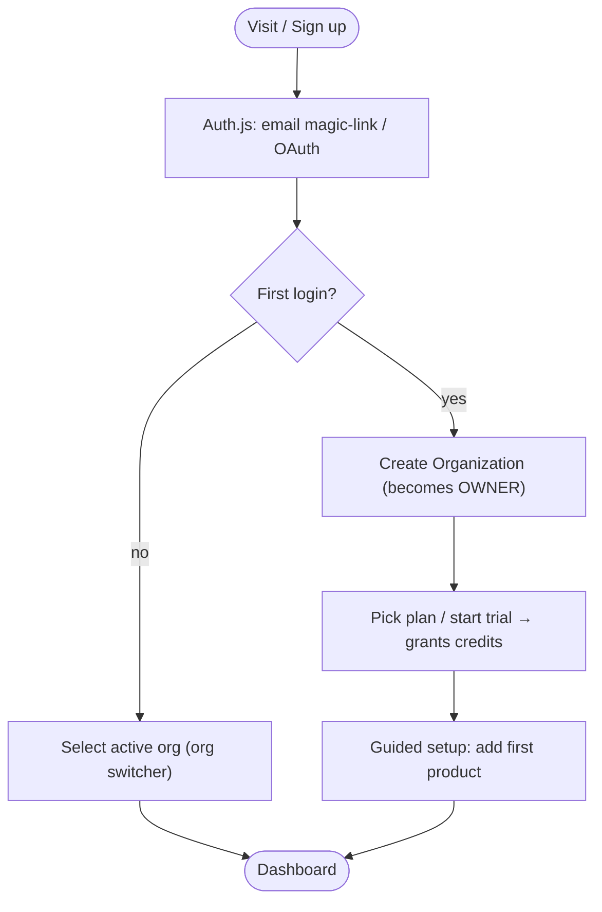
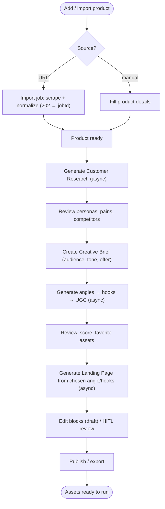
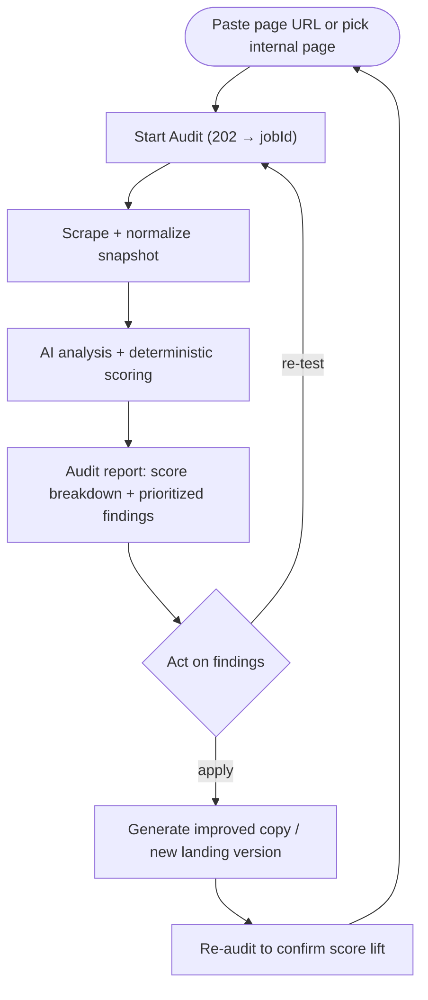
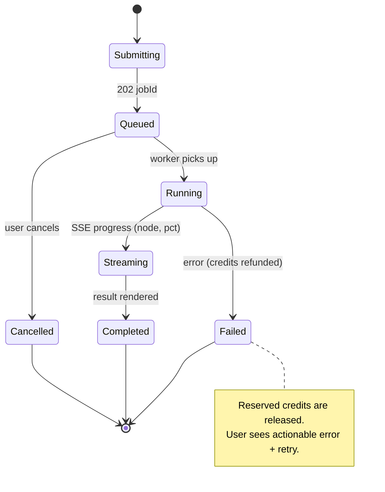
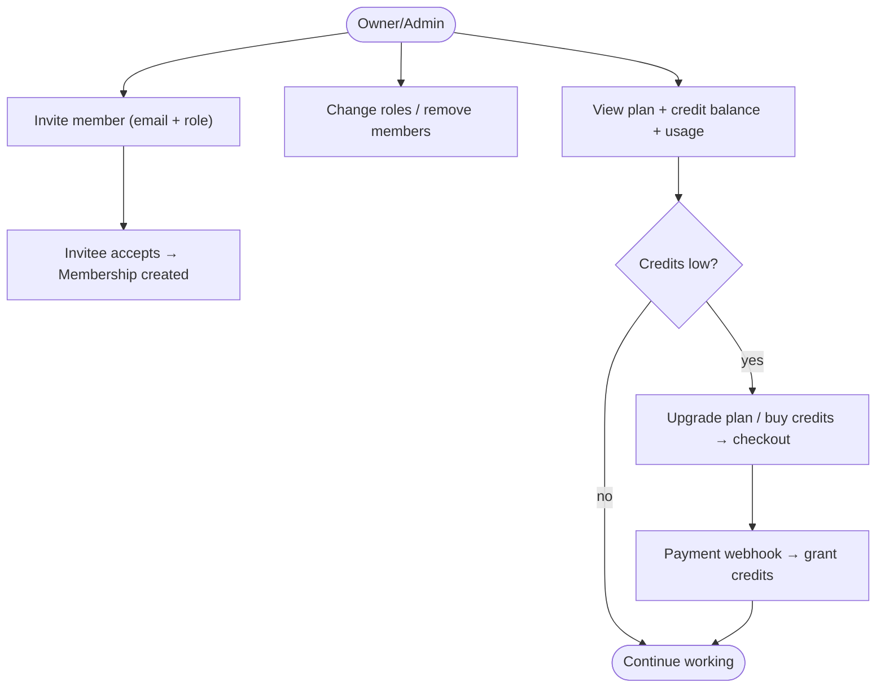

# 06 — User Flows

Covers: end-to-end user journeys across the platform.

---

## 1. Personas

| Persona | Goal | Primary flows |
|---------|------|---------------|
| **Solo DTC operator** | Launch & optimize one store fast | Onboard → product → research → creative → landing |
| **Agency strategist** | Run many client brands | Multi-org/workspaces, research, creative at scale |
| **CRO specialist** | Improve existing pages | Audit → recommendations → re-test |
| **Org owner/admin** | Manage team, billing, usage | Invites, roles, plan, credit monitoring |

---

## 2. Onboarding & Org Setup

---

## 3. Core Value Loop (product → assets)

**Async UX contract:** every "Generate" action returns immediately with a job; the UI shows a progress card (SSE/poll), and the result streams into place. The user can navigate away and return — jobs are durable.

---

## 4. Audit & CRO Loop

---

## 5. Generation Job — UX states

---

## 6. Team & Billing

**Credit-exhaustion UX:** when a generation would exceed balance, the action is blocked *before* enqueue with a clear upgrade prompt (never a silent failure mid-job). In-flight jobs that hit `CreditsExhausted` fail gracefully and refund the reservation.

---

## 7. Role-based capability matrix

| Capability | OWNER | ADMIN | EDITOR | VIEWER |
|-----------|:----:|:----:|:----:|:----:|
| View assets | ✅ | ✅ | ✅ | ✅ |
| Generate (spend credits) | ✅ | ✅ | ✅ | ❌ |
| Publish landing page | ✅ | ✅ | ✅ | ❌ |
| Manage products | ✅ | ✅ | ✅ | ❌ |
| Invite / manage members | ✅ | ✅ | ❌ | ❌ |
| Billing & plan | ✅ | ❌ | ❌ | ❌ |
| Delete org | ✅ | ❌ | ❌ | ❌ |
