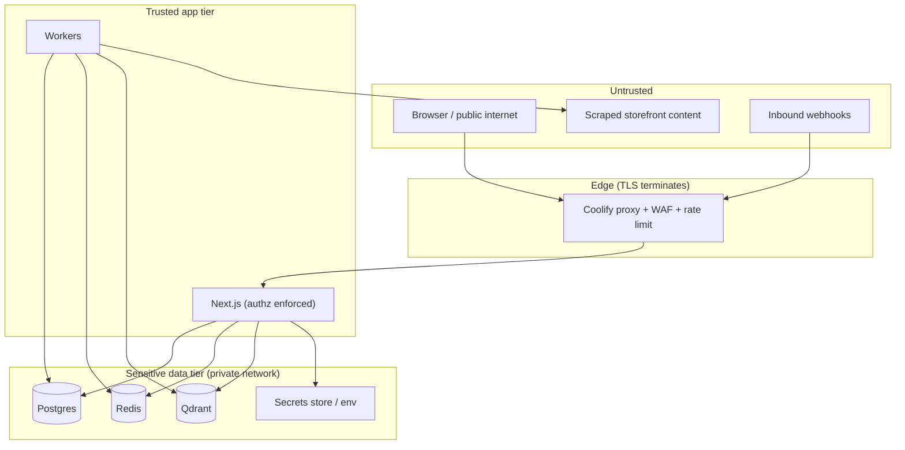
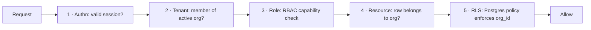
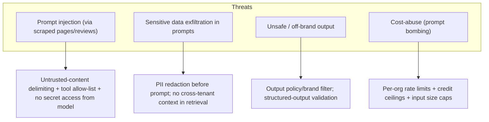

# 07 — Security Architecture

Covers: authentication, authorization, tenant isolation, secrets, data protection, AI-specific threats, compliance.

---

## 1. Trust Boundaries

Data stores are **never** exposed publicly — only reachable on the private Docker network. The only ingress is the reverse proxy.

---

## 2. Authentication (Auth.js)

- **Methods:** email magic-link + OAuth (Google) for low-friction onboarding.
- **Sessions:** secure, http-only, SameSite cookies; database-backed sessions for revocation.
- **CSRF:** Server Actions and Auth.js provide built-in CSRF protection; REST mutations require same-site cookie or signed bearer.
- **Programmatic access (future):** scoped, hashed API keys per org with prefix + last-4 display; revocable.
- **MFA (roadmap):** TOTP for OWNER/ADMIN on sensitive orgs.

---

## 3. Authorization (multi-layer)

- **RBAC** roles: OWNER > ADMIN > EDITOR > VIEWER, mapped to capabilities (see [06 §7](./06-user-flows.md)). Checks live in a central `authorize(ctx, action, resource)` policy, called by use cases — not scattered in controllers.
- **Resource ownership** verified by tenant-scoped repositories.
- **RLS** is the backstop: even a logic bug cannot return another org's rows.

---

## 4. Multi-Tenant Isolation (security view)

| Layer | Control | Failure mode it prevents |
|-------|---------|--------------------------|
| App context | `orgId` from session only, never from body/query | IDOR via tampered org id |
| Repository | Auto-injected `organization_id` filter | Forgotten WHERE clause |
| Database | Postgres RLS via `app.org_id` GUC | ORM/raw-query mistakes |
| Vector store | Mandatory org payload filter in adapter | Cross-tenant RAG leakage |
| Queue/worker | `orgId` in job payload re-establishes RLS GUC | Background-job leakage |
| Cache keys | Namespaced by `orgId` | Cache cross-talk |

**Connection handling:** each request/worker transaction sets `SET LOCAL app.org_id = '<orgId>'` before queries; RLS policies reference it. Pooled connections never leak the GUC across transactions (`SET LOCAL` is transaction-scoped).

---

## 5. Secrets & Key Management

- Secrets (OpenRouter key, DB creds, payment secrets, Resend key) injected via **environment** managed by Coolify; never committed.
- Separate keys per environment (dev/stage/prod); least-privilege.
- Outbound provider keys are **server/worker-only** — never shipped to the browser.
- Webhook secrets rotated; payloads HMAC-verified before processing.
- API keys stored **hashed** (argon2/bcrypt); shown once on creation.

---

## 6. Data Protection

| Concern | Control |
|---------|---------|
| In transit | TLS everywhere (edge + internal where supported) |
| At rest | Encrypted volumes; DB backups encrypted |
| PII minimization | Store only necessary user fields; scraped data scoped to product context |
| GDPR data export | Per-org export job (Postgres + Qdrant + object storage) |
| GDPR erasure | Hard-delete cascade + Qdrant point purge + backup tombstone policy |
| Audit trail | Immutable `ActivityLog` for sensitive actions (role change, billing, exports, deletes) |
| Backups | Automated Postgres dumps + Qdrant snapshots; tested restore runbook |

---

## 7. AI-Specific Threats

- **Scraped content is untrusted input**, not instructions. It enters prompts in a delimited block; the model's available tools are an explicit allow-list with no filesystem/secret/cross-tenant access.
- **No data crosses tenants** in RAG — retrieval is org-filtered at the adapter.
- **Outputs validated** against Zod schemas and a brand/policy filter before persistence or display.

---

## 8. Application Security Baseline

- Input validation (Zod) at every boundary; output encoding by React.
- Security headers (CSP, HSTS, X-Content-Type-Options, Referrer-Policy) at the edge.
- Rate limiting + bot protection on auth and generation endpoints.
- Dependency scanning (SCA) + container image scanning in CI; Dependabot/renovate.
- SSRF protection on the **scraper**: URL allow/deny rules, block private IP ranges/metadata endpoints, fetch through an egress proxy, timeouts and size caps.
- Least-privilege DB roles (app role cannot bypass RLS; migration role separate).
- Secrets never logged; structured logs scrub tokens/PII.

---

## 9. Incident Readiness

- Centralized structured logging + alerting (Grafana alerts on error rate, auth failures, queue DLQ growth, spend spikes).
- Traceable requests (`traceId` in every error response and log line).
- Documented runbooks: credential rotation, restore-from-backup, tenant data-leak response, AI-cost runaway kill-switch (disable generation queue per-org or globally).
