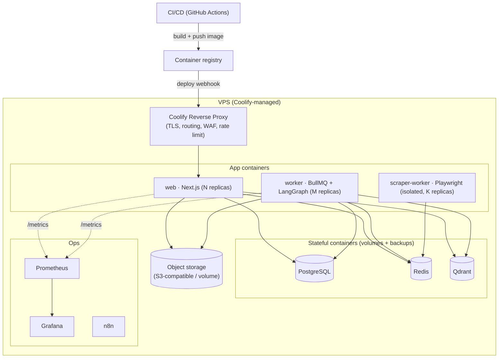
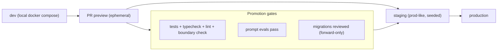
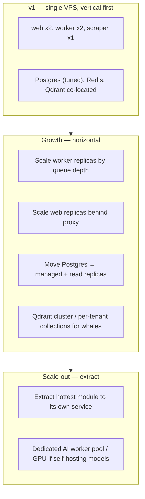
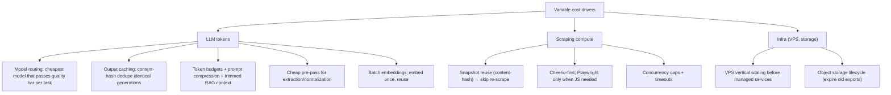
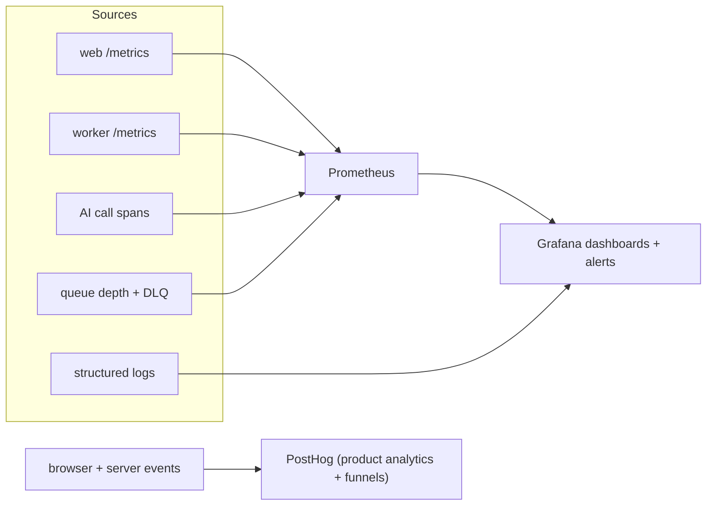
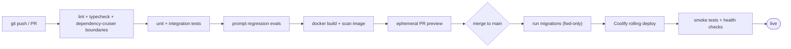

# 08 — Deployment, Scalability, Cost & Observability

Covers: deployment architecture, scalability strategy, cost optimization, monitoring.

---

## 1. Deployment Architecture (Docker + Coolify + VPS)

**Topology rationale:**
- **web** and **worker** are separate services from one image (different entrypoints) so they scale and fail independently.
- **scraper-worker** is isolated (Playwright is memory-heavy and runs untrusted pages) with its own resource limits and egress proxy.
- Stateful services run as managed containers with persistent volumes and scheduled backups; for production scale they can be promoted to managed Postgres/Redis without app changes.

### 1.1 Environments & promotion

**Release safety:** forward-only Prisma migrations applied before new app version goes live; RLS policies migrate alongside tables; blue/green or rolling deploy via Coolify; health checks gate traffic; one-click rollback to previous image.

---

## 2. Scalability Strategy

| Dimension | Strategy |
|-----------|----------|
| **Stateless web** | Horizontal replicas behind proxy; sessions in DB/Redis, so any replica serves any user |
| **Workers** | Scale by **queue depth** (autoscale signal = `ai.generation` backlog); per-queue concurrency caps |
| **Database** | Vertical first (CPU/RAM/IO), then connection pooling (PgBouncer), then read replicas for analytics/read models |
| **Vector** | Payload-filtered shared collection → dedicated collections for large tenants → Qdrant cluster |
| **Hot reads** | Redis cache + Next.js data cache absorb read load |
| **Tenant fairness** | Per-org concurrency + rate limits prevent one whale starving the pool |
| **Bottleneck = LLM** | Mostly external (OpenRouter) — scale by concurrency + caching, not our CPU |

**Modular monolith → services:** because modules already talk via public APIs/events, the highest-load context (likely `creative` or `audit`) can be lifted into its own deployable with minimal change when justified.

---

## 3. Cost Optimization Strategy

AI tokens and scraping are the dominant variable costs. Levers, highest-impact first:

| Lever | Mechanism | Impact |
|-------|-----------|--------|
| **Model routing** | Task-class → smallest sufficient model; escalate only on failure | High |
| **Generation cache** | Dedupe identical `(promptVersion+model+inputHash)` results; serve cached, don't re-bill | High |
| **Credit metering** | Every spend hits the ledger → real-time cost visibility + plan ceilings prevent runaway | High |
| **RAG trimming** | Token-budgeted, reranked context instead of dumping everything | Medium |
| **Snapshot reuse** | Re-audit uses existing snapshot if content unchanged | Medium |
| **Cheerio-first scraping** | Avoid headless browser unless page needs JS | Medium |
| **Batch + off-peak** | Batch embeddings; defer non-urgent jobs | Low–Med |
| **Kill-switch** | Per-org/global generation disable on spend anomaly | Risk control |

**Unit economics:** credits map to model cost + margin; the ledger + PostHog give per-org/per-feature cost-to-revenue, so pricing stays profitable as model prices shift (router rebalances).

---

## 4. Observability (Prometheus + Grafana + PostHog)

| Signal | Tool | Examples |
|--------|------|----------|
| **System metrics** | Prometheus/Grafana | latency, error rate, CPU/RAM, DB connections |
| **Queue health** | Prometheus | backlog per queue, processing time, DLQ size, retries |
| **AI ops** | Prometheus + ledger | tokens, cost/job, model mix, failover rate, cache-hit rate |
| **Product analytics** | PostHog | activation, feature funnels, generation success, retention |
| **Logs/traces** | structured logs + `traceId` | request tracing, error context |
| **Alerts** | Grafana | error-rate spike, DLQ growth, spend anomaly, auth-failure spike, DB saturation |

**SLO targets (initial):** web p95 < 500ms (excludes async jobs); job success rate > 98%; generation queue p95 wait < 30s under normal load. Alerts fire on SLO burn.

---

## 5. CI/CD Pipeline

Boundary checks and prompt evals are first-class gates — they protect the two things most likely to silently rot: module isolation and AI output quality.
