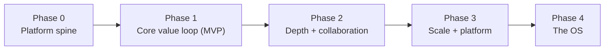
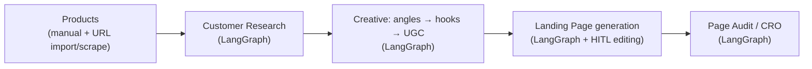

# 09 — MVP & Future Roadmap

Covers: MVP roadmap, future roadmap, sequencing rationale.

---

## 1. Sequencing Principle

Build the **platform spine once**, then add AI features as graphs on top. The spine (auth, tenancy, billing/credits, job system, AI gateway, RAG) is what makes every feature cheap to add. Ship the **core value loop** end-to-end before breadth.

---

## 2. MVP Roadmap

### Phase 0 — Platform Spine (foundation, no end-user features yet)
- Modular-monolith skeleton + Clean Architecture wiring + composition root.
- Auth.js (magic-link + OAuth), Organizations, Memberships, RBAC, org switcher.
- Multi-tenancy: `organizationId` scoping + Postgres RLS + tenant-scoped repositories.
- Job system: BullMQ queues, worker process, outbox relay, job status API + SSE.
- AI gateway: OpenRouter integration + model router + structured-output validation.
- RAG baseline: Qdrant adapter, chunker, embedder, org-filtered retrieval.
- Billing/credits: plans, subscription, credit ledger (reserve/commit/refund), metering.
- Observability: Prometheus/Grafana, PostHog, structured logging.
- CI/CD: Docker images, Coolify deploy, migrations, boundary + eval gates.

**Exit criteria:** a tenant can sign up, an org exists, a trivial async AI job runs end-to-end, spends a credit, and is observable.

### Phase 1 — Core Value Loop (the MVP users pay for)

- **Products:** create manually + import via scrape (Cheerio-first, Playwright fallback) + snapshots.
- **Customer Research:** personas, pains, desires, objections, competitor angles → versioned report.
- **Creative:** brief → marketing angles → hooks → UGC concepts, scored/ranked, with provenance.
- **Landing Page:** generate structured page from chosen angle/hooks; block editor (draft/publish/version); export.
- **Audit/CRO:** audit a URL or internal page → score + prioritized findings + recommendations; re-test loop.
- **Account:** team invites, roles, billing/credits UI, usage dashboard.

**Exit criteria:** a paying org completes product → research → creative → landing → audit without leaving the app; cost-per-org is visible and profitable.

---

## 3. Post-MVP — Phase 2 (Depth & Collaboration)
- **Workspaces/brands within an org** (agencies managing many clients).
- **Asset library & history**, favorites, tagging, search across generations.
- **Collaboration:** comments, approvals, shareable read-only links.
- **A/B variants** for hooks/angles/pages + outcome tracking.
- **Brand kit / voice profiles** feeding RAG for on-brand output.
- **Templates & presets** for briefs and pages.
- **Deeper integrations:** Shopify product sync, ad-platform export formats.
- **Prompt eval dashboard** + per-feature quality scoring.

## 4. Phase 3 (Scale & Platform)
- **Public API + API keys** (programmatic access) and **webhooks out**.
- **n8n-powered automations** exposed to users (triggers/actions, "when research done → generate creative").
- **Usage-based billing refinements**, seat management, enterprise plans.
- **Schema-per-tenant option** for enterprise isolation; SSO/SAML; MFA enforcement.
- **Read replicas / Qdrant clustering**; extract hottest module to a service if needed.
- **Multi-region** option for data residency.

## 5. Phase 4 — The Ecommerce Growth OS (vision)
- **Performance feedback loop:** ingest real ad/store performance → close the loop so the AI learns what converts per brand.
- **Agentic campaigns:** end-to-end "research → creative → page → audit → iterate" orchestrated agents with human approval gates.
- **Creative intelligence:** trend/competitor monitoring, winning-pattern mining across (anonymized, opt-in) data.
- **Marketplace:** community templates, agencies offering productized services on the platform.
- **Multi-channel:** email/SMS flows (Resend + flows), ad-account integrations, UGC production pipeline.

---

## 6. Roadmap → Architecture Traceability

| Roadmap item | Already supported by architecture | New capability needed |
|--------------|-----------------------------------|-----------------------|
| Any new AI feature | Job system, AI gateway, RAG, credits | Just a new LangGraph graph + prompts + module use case |
| Workspaces/brands | Org/tenancy model | Sub-tenant entity under org |
| Public API | Route handlers, RBAC | API-key auth adapter |
| Automations | Event bus, n8n, webhooks | User-facing automation builder |
| Enterprise isolation | Tenancy abstraction | Schema-per-tenant adapter, SSO |
| Performance loop | Events, analytics | Ingestion connectors + feedback store |

The architecture is deliberately **feature-additive**: the expensive parts (tenancy, jobs, AI plane, billing) are built once in Phase 0, so Phases 1–4 are mostly "add a graph + a module use case + UI," not re-platforming.

---

## 7. Risks & Mitigations

| Risk | Mitigation |
|------|-----------|
| AI cost runaway | Credit ceilings, generation cache, model routing, spend alerts + kill-switch |
| Output quality variance | Structured outputs, self-eval, prompt eval gates, HITL on high-stakes pages |
| Scraper fragility / legal | Cheerio-first, robust normalization, SSRF guards, respect robots/ToS, snapshot reuse |
| Tenant data leak | 3-layer isolation (app + RLS + vector filter), tested |
| Monolith rot | Enforced module boundaries in CI, public-API-only imports |
| Vendor lock-in (OpenRouter) | Gateway port abstraction; provider failover; swap behind one adapter |
| Solo-team velocity | Modular monolith + feature-additive design keeps each new feature small |
